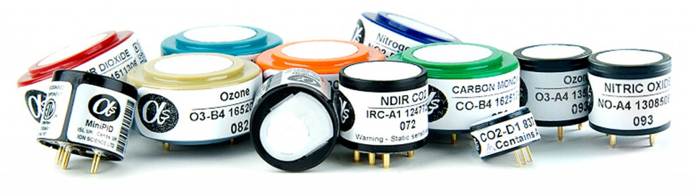

# Requisitos

Para as propostas de solução fora levantados os requisitos dos subsistemas do projeto. Após isso as diretorias se reuniram e elaboraram uma proposta de solução.

## 1. Requisitos de Alto-nível

### 1.1 Requisitos de Eletrônica

* Realização do controle do sensoriamento solar;
* Detecção solar;
* Comunicação com a internet;
* Armazenamento de dados caso falha de conexão com a nuvem;
* Envio de dados tratados para nuvem;
* Medição de gases poluentes: Dióxido de enxofre (SO 2 ), Dióxido de Nitrogênio (NO 2 ), Ozônio (O 3 ), Monóxido de carbono (CO) e Fumaça;
* Medição de Partículas: MP2,5 e MP10;
* Medição de temperatura, umidade e pressão do ar.

### 1.2 Requisitos de Energia

* A alimentação deve ser baseada em painéis fotovoltaicos;
* Baterias devem dar autonomia energética para dias nublados e noites;
* O sistema fotovoltaico deve ser implementado com sensoriamento solar;

## 2. Solução de Elétrica

A solução proposta para a área elétrica é dividida em Eletrônica e Energia. A Eletrônica foi dividida em dois sistemas denominados: Instrumentação eletrônica e Embarcados, já a Energia conta com um componente o sistema fotovoltaico.

### 2.1 Instrumentação eletrônica

É responsável pela coleta de dados de interesse, realizando aquisição e condicionamento do sinal para disponibilização para o microcontrolador/microprocessador. Os dados de interesse são: gases e partículas poluentes, fumaça, posição solar, temperatura, umidade e pressão. Por tanto, deve-se ser escolhido sensores que permitam a leitura destes dados e que se adequem ao escopo da estrutura. O condicionamento deve adequar o sinal adquirido pelos sensores para o microcontrolador/microprocessador escolhido, além de realizar uma pré-filtragem.

### 2.2 Embarcados

É o componente que realiza o processamento do dados coletados e disponibiliza na API do Zéfiro para uso do cliente e da aplicação. Também é responsável pela automatização da instrumentação eletrônica e da alimentação sustentável. A automatização da instrumentação eletrônica busca gerenciar as leituras dos sensores de forma que não se tenha uma leitura excessiva de dados e que ocorra o menor gasto energético possível. Para a alimentação sustentável é necessário o controle do sistema de sensoriamento solar. Os dados para a nuvem devem ser disponibilizados de forma que a informação seja simplificada e já processada.

### 2.3 Sistema Fotovoltaico

Esse componente de solução é o que permite a autonomia da estação; ele compreende um sistema fotovoltaico off-grid e o sensoriamento solar. O sistema fotovoltaico deverá suprir a potência requisitada pelo sistema eletrônico, a proposta de sensoriamento solar visa aumentar o grau de eficiência da aquisição de energia.
