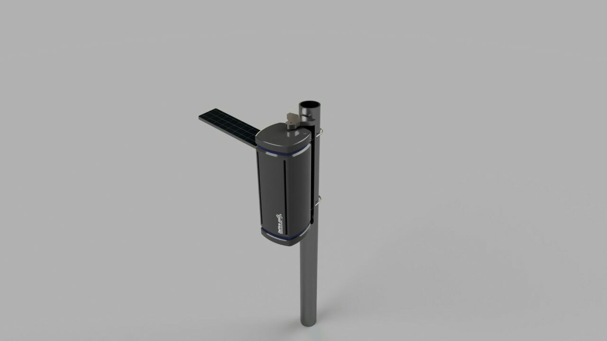
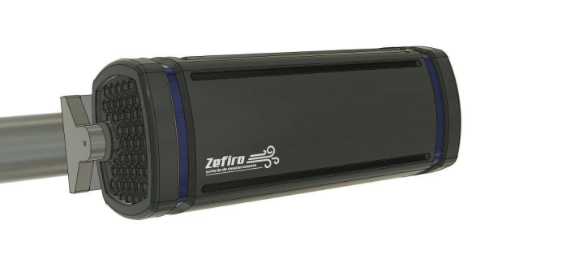

# Solução Estrutural

## 1. Requisitos de Estrutura

- Alocar e proteger fisicamente os componentes que compõem as partes eletrônicas do projeto, sendo esses: placas de circuito, sondas(sensores), bateria e painel solar.

- Resistência a ambiente externo
    * resistência a raios UV e intemperismo
    * resistência a chuva baseada na norma ABNT NBR IEC 60529 - Graus de proteçãoprovidos por invólucros (Códigos IP) IP52

- IP52 [protegido contra ingresso de poeira (o ingresso de poeira não está totalmente evitado, mas a poeira não deve ingressar em quantidade que possa interferir na operação do equipamento ou prejudicar segurança. - protegido contra queda de água com inclinação de até 15o com a vertical, gotas caindo na vertical não devem provocar efeitos prejudiciais quando o
invólucro e inclinado num angulo até 15o de cada lado da vertical)]

- Sistema automatizado de deslocamento para otimização de captação de energia em painel
solar.

- Fácil manutenção

- Fácil instalação

## 2. Solução de Estrutura

O sistema de monitoramento do ar tem como foco a facilitar a instalação, operação e a manutenção. Sendo assim, o equipamento deverá ser leve, de fácil acesso a componentes internos e ao mesmo tempo resistente para funcionar nas diversas condições ambientais, como exposição ao Sol, chuva, rajadas, entre outros. Tais características tornam o dispositivo portátil o suficiente para possibilitar a instalação em diferentes regiões de forma a mapear a qualidade do ar de uma área significativamente maior.

A estrutura consiste num gabinete em forma de torre onde ficarão o sistema de alimentação e o de sensoriamento. Internamente a torre é dividida em dois espaços, um estará alojados os circuitos eletrônicos de alimentação, enquanto o outro será um mini túnel de vento onde os sensores irão analisar a qualidade do ar circundante. Conforme mostra a Fig.1, na lateral desse gabinete haverá uma plataforma móvel onde será instalado o painel solar, essa plataforma terá um grau de liberdade possibilitando o painel solar movimentar na direção azimutal.

Este gabinete será montado sobre mancais que dará a estação, um segundo grau de liberdade, podendo girar em seu próprio eixo em que se prenderá por presilhas em uma haste metálica. Sendo assim, a estrutura permitirá a inserção de um sistema de rastreamento solar de maneira eficiente e discreta. A haste foi escolhida pois permite uma instalação de módulos adjacentes, exemplo antenas de comunicações.

Figura 1: CAD Preliminar superior da estação de monitoramento de ar.

Haverá uma grelha na parte de baixo (Fig. 2) do gabinete de forma a permitir a entrada de ar para o sistema, tanto para o monitoramento, quando para a refrigeração dos componentes elétricos. Para o sistema de monitoramento, internamente terá um tubo de Venturi de forma que o escoamento de ar seja laminar ao atravessar os sensores. Assaídas de ar serão nas laterais, pois facilitará a saída do ar que estará com uma temperatura mais elevada do que o ambiente.

Figura 2: CAD Preliminar do gabinete, dando destaque ao mancal de suporte, a grelha de entrada
de ar e as saídas de ar laterais.