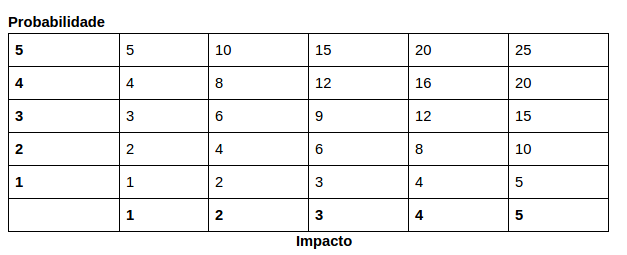

# Plano de Gerenciamento de Riscos

## Escopo
O plano de risco tem como objetivo descrever quais são os riscos do projeto, como eles serão monitorados e controlados ao longo das sprints, visando entender seus impactos, procurando formas de mitigar esses possíveis riscos.

## Riscos e suas consequências 

### Riscos de projeto
| | | | | | |
|---|--------|----------|---|---|---|
|Id|Risco|Consequência|Probabilidade|Impacto|Risco|
|1|Desistência de membros|Sobrecarga dos membros remanescentes, distribuição de tarefas|2|4|8|
|2|Mudança arquitetural|Gera retrabalho, como alteração nas tarefas planejadas, mudanças estruturais e mudanças a nível de código.|2|5|10|
|3|Falha na comunicação|Erros e até perdas de informação|5|5|25|
|4|Mudança de escopo|Alteração no cronograma e redefinição dos requisitos|3|5|15|
|5|Descomprometimento da equipe|Falhas na entrega, desgaste nos membros comprometidos|5|5|25|
|6|Erro de priorização|Estimativa de produtividade e refatoração|3|4|12|
|7|Imaturidade na gerência|Diminui qualidade das entregas, aumenta o custo do projeto, afeta o planejamento, entre outros|3|5|15|
|8|Planejamento falho*|Alteração do cronograma, falhas na entrega|3|5|15|
 
### Riscos técnicos

| | | | | | |
|---|-------|-------|---|---|---| 
|ID|Risco|Consequência|Probabilidade|Impacto|Risco|
|9|Dificuldade com as tecnologias adotadas|Prazo e qualidade de entrega, priorização de requisitos, planejamento, entre outros.|5|4|20|
|10|Integração entre áreas|Produto não atender as necessidades do cliente|4|5|20|
|11|Atraso nas entregas|Planejamento e prazo|4|4|16|

### Riscos externos

| | | | | | |
|---|------|-------|---|---|---|
|ID|Risco|Consequência|Probabilidade|Impacto|Risco|
|12|Greve na UnB|Viabilidade do projeto|1|1|1|
|13|Covid-19|Falta de algum membro. Falta de maior contato entre o time pelo distanciamento|3|4|12|
|14|Política Pública|Alteração na política existente pode prejudicar a execução do projeto|1|3|3|

### Risco de produto

| | | | | | |
|---|-------|------|---|---|---|
|ID|Risco|Consequência|Probabilidade|Impacto|Risco|
|15|Produto não atender aos objetivos|O problema levantado não ser solucionado.|2|5|10|
|16|Instalação do Painel Fotovoltaico em área de sombreamento|Diminuir a geração de energia que abastece o sistema|3| | |

## Análise Qualitativa e Quantitativa dos Dados

A análise qualitativa e quantitativa dos riscos do projeto é feita a partir da probabilidade de ocorrência, do impacto gerado e a partir desses dois valores a análise do grau de risco. As tabelas a seguir mostram como esses valores são definidos.

### Probabilidade

| | | |
|---|---|---|
|Probabilidade|% de certeza|Peso|
|Nula|0%|0|
|Muito baixa|0 a 20%|1|
|Baixa|20 a 40%|2|
|Média|40 a 60%|3|
|Alta|60 a 80%|4|
|Muito alta|80 a 100%|5|
 
### Impacto

| | | |
|---|---|---|
|Impacto|Impacto sobre o Custo Original (%)|Peso|
|Nulo|0%|0|
|Muito Baixo|1 a 5%|1|
|Baixo|5 a 10%|2|
|Médio|10 a 15%|3|
|Alto|15 a 20%|4|
|Muito alto|Acima de 20%||

O grau de risco é definido pela multiplicação da probabilidade pelo impacto. Conforme tabela abaixo.

Sendo que:
- Risco >= 15: elevado
- 5 < Risco < 15: médio
- Risco =< 5: baixo

### Análise dos Riscos

| | | | | |
|---|---|---|---|---|
|ID|Descrição|Probabilidade|Impacto|Risco|
|3|Falha na comunicação|5|5|25|
|5|Descomprometimento da equipe|5|5|25|
|9|Dificuldade com as tecnologias adotadas|5|4|20|
|10|Integração entre áreas|4|5|20|
|11|Atraso nas entregas|4|4|16|
|4|Mudança de escopo|3|5|15|
|7|Imaturidade na gerência|3|5|15|
|8|Planejamento falho*|3|5|15|
|6|Erro de priorização|3|4|12|
|13|Covid-19|3|4|12|
|2|Mudança arquitetural|2|5|10|
|15|Produto não atender aos objetivos|2|5|10|
|1|Desistência de membros|2|4|8|
|14|Política Pública|1|3|3|
|12|Greve na UnB|1|1|1|
|16|Instalação do Painel Fotovoltaico em área de sombreamento| | | |

### Planejamento de Respostas aos Riscos

| | | | | | |
|---|---|---|---|---|---|
|ID|Descrição|Risco|Ação|Descrição da Ação|Responsável|
|1|Desistência de membros|8|Aceitar|Realocação de Tarefas|Diretores|
|2|Mudança arquitetural|10|Mitigar|Pensamento crítico a respeito da arquitetura e procurando professores e outros suportes para a construção Arquiteta de Software|
|3|Falha na comunicação|25|Prevenir|Realizando sempre todos os rituais e incentivando a comunicação por issue|Diretores e Gerente geral|
|4|Mudança de escopo|15|Prevenir|Validando constantemente com os stakeholders|Diretores e Gerente geral|
|5|Descomprometimento da equipe|25|Prevenir|Mostrar o propósito de suas ações, trazendo a sensação de responsabilidade.|Equipe geral|
|6|Erro de priorização|12|Prevenir|Utilizando técnicas de priorização e estar constantemente reavaliando a priorização|Diretores|
|7|Imaturidade na gerência|15|Mitigar|Mantendo o pensamento crítico e estratégico a respeito das métricas coletadas e realizando todos os rituais.|Manter o alinhamento.|Gerente geral|
|8|Planejamento falho*|15|Prevenir|Validar constantemente o planejamento, focando sempre em entregar valor.|Gerente geral e diretores|
|9|Dificuldade com as tecnologias adotadas|20|Mitigar|Promover treinamentos e fornecer suporte para dúvidas e dificuldades. Manter o canal de comunicação aberto.|Diretores|
|10|Integração entre áreas|20|Mitigar|Manter as informações sempre alinhadas fazendo uso da boa comunicação.|Gerente geral|
|11|Atraso nas entregas|16|Prevenir|Realizando os rituais e observando ao longo da sprint a necessidade de intervenção dos diretores.|Equipe toda|
|12|Greve na UnB|1|Aceitar|Reavaliar o planejamento do projeto|Diretores e Gerente geral|
|13|Covid-19|12|Aceitar|Distribuição de tarefas e reavaliar o planejamento do projeto|Diretores e Gerente geral|
|14|Política Pública|3|Aceitar| | |
|15|Produto não atender aos objetivos|10|Prevenir|Fazendo uma pesquisa de mercado e avaliando se a solução atende ao problema|Diretores e Gerente geral|
|16|Instalação do Painel Fotovoltaico em área de sombreamento| | | |