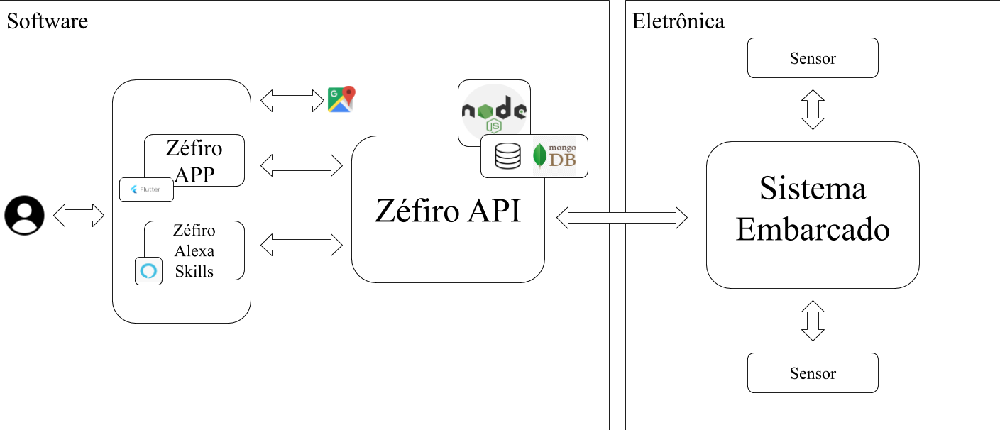

# Zéfiro
## Arquitetura
### Versão 1.3

## Histórico de Revisão

| Data | Versão | Descrição | Autor |
|------|--------|-----------|-------|
|09/09/2020|1.0|Definição da arquitetura e tecnologias|Amanda Muniz e Vitor Cardoso|
|11/09/2020|1.1|Criação dos diagramas de pacotes|Amanda Muniz e Vitor Cardoso|
|13/09/2020|1.2|Criação do diagrama de classes e refatoração do diagrama de relações|Amanda Muniz, Luciana Ribeiro e Calebe Rios|
|20/09/2020|1.3|Criação do tópico 1 e refatoração do diagrama de relações|Amanda Muniz|

# 1. Introdução
## 1.1 Finalidade

&emsp;&emsp;Este documento tem como finalidade fornecer uma visão geral da arquitetura do Zéfiro, utilizando-se de diversas visões arquiteturais - tais como a visão de microsserviços e de diagramas - a fim de facilitar o entendimento dos processos e funcionamento de todo o sistema. Tem também como objetivo transmitir as decisões arquiteturais significativas tomadas em relação ao mesmo.

## 1.2 Escopo

&emsp;&emsp;Através desse documento, é possível obter um melhor entendimento da arquitetura do Zéfiro, permitindo ao leitor compreender o funcionamento de seu sistema, como também a abordagem utilizada para o seu desenvolvimento.

## 1.3 Definições, Acrônimos e Abreviações
| Termo | Definição |
|--|--|
| API | Application Program Interface (Interface de Programação de Aplicações) |
| HTTP | HyperText Transfer Protocol (Protocolo de Transferência de Hipertexto) |

## 1.4 Referências
> JACKSON, Cam; Micro Frontends; Disponível em: <[https://martinfowler.com/articles/micro-frontends.html](https://martinfowler.com/articles/micro-frontends.html)>; Acesso em 10 de setembro de 2020;

> LEWIS, James; FOWLER, Martin; Microsserviços em poucas palavras; Disponível em: <[https://www.thoughtworks.com/pt/insights/blog/microservices-nutshell](https://www.thoughtworks.com/pt/insights/blog/microservices-nutshell)>; Acesso em 20 de setembro de 2020.

> GEERS, Michael; Micro Frontends extending the microsservice idea to frontend development; Disponível em <[https://micro-frontends.org/](https://micro-frontends.org/)>; Acesso em 10 de setembro de 2020.

> DEMEDYUK, Ihor; TSYBULSKYI, Nazar; Flutter vs Native vs React-Native: Examining performance. Disponível em: <[https://medium.com/swlh/flutter-vs-native-vs-react-native-examining-performance-31338f081980](https://medium.com/swlh/flutter-vs-native-vs-react-native-examining-performance-31338f081980)>; Acesso em 10 de setembro de 2020;

> JAYARAM, Prashanth; When to Use (and Not to Use) MongoDB; Disponível em <[https://dzone.com/articles/why-mongodb#:~:text=The%20motivation%20of%20the%20MongoDB,BSON%20documents%20to%20store%20data](https://dzone.com/articles/why-mongodb#:~:text=The%20motivation%20of%20the%20MongoDB,BSON%20documents%20to%20store%20data)>; Acesso em 10 de setembro de 2020;

> Introdução Express/Node. MDN, 2020; Disponível em: <[https://developer.mozilla.org/pt-BR/docs/Learn/Server-side/Express_Nodejs/Introdu%C3%A7%C3%A3o](https://developer.mozilla.org/pt-BR/docs/Learn/Server-side/Express_Nodejs/Introdu%C3%A7%C3%A3o)>; Acesso em 10 de setembro de 2020;

> APIs de geolocalização. Google Maps Platform; Disponível em: <[https://cloud.google.com/maps-platform](https://cloud.google.com/maps-platform)>; Acesso em 10 de setembro de 2020;

> What is Alexa? Amazon Alexa Official Site. Disponível em: <[https://developer.amazon.com/pt-BR/alexa](https://developer.amazon.com/pt-BR/alexa)>; Acesso em 10 de setembro de 2020;

# 2. Representação Arquitetural

## 2.1 Diagrama de Relações

&emsp;&emsp;O estilo arquitetural de microsserviços é uma abordagem que visa implementar uma aplicação como uma suíte de pequenos serviços. Onde cada um executa um processo próprio e se comunica, geralmente, com requests HTTP. Em 2016, o termo micro frontend foi falado pela primeira vez no Thoughtworks Technology Radar, com o intuito de estender o conceito de microsserviços para o desenvolvimento frontend, onde cada uma desses “serviços” precisam ser completamente isolados dos outros com tecnologias e objetivos próprios.

&emsp;&emsp;Tendo em vista as principais características desses dois estilos arquiteturais o software Zéfiro será criado com base neles. Onde teremos um microsserviço para o backend, chamado de Zéfiro API e dois micro frontends sendo eles, o Zéfiro APP e o Zéfiro Alexa Skills. Cada um desses três serviços terão seu próprio repositório, de forma que estes possuam ambiente de desenvolvimento, tecnologias, integração contínua e deploy específicos.

&emsp;&emsp;O software Zéfiro será dividido em três serviços independentes:

-   Zéfiro APP
    
-   Zéfiro Alexa Skills
    
-   Zéfiro API

&emsp;&emsp;Para o desenvolvimento do software, faz-se necessário o consumo de dados de fontes externas, sendo elas:

-   Google Maps API
    

## 2.2 Representação dos Serviços

### 2.2.1 Zéfiro APP

&emsp;&emsp;O Zéfiro APP será uma aplicação mobile responsável pelo contato direto com o usuário. Esta precisará seguir uma arquitetura da informação bem definida e garantir acessibilidade. Ela é responsável também por exibir um gráfico com o histórico do indicador de qualidade do ar, apresentar informações sobre quais elementos o usuário está respirando naquele momento e um mapa com as estações de monitoramento do ar. Precisa ainda enviar notificação para o usuário e exibir um alerta de fumaças.

### 2.2.2 Zéfiro Alexa Skills

&emsp;&emsp;O Zéfiro Alexa Skills será uma aplicação que faz interação com o usuário por meio de comandos de voz. Ela será responsável por responder como está a qualidade do ar, com base na faixa de qualidade do ar internacional, qual foi a qualidade do ar nos últimos sete dias e quais são os elementos químicos que o usuário está respirando no momento do seu pedido.

### 2.2.3 Zéfiro API

&emsp;&emsp;
O Zéfiro API é responsável por lidar com o core do projeto, - monitoramento da qualidade do ar. Para isso ele possui diversas funcionalidades. A principal delas é o cálculo da qualidade do ar, feita de acordo com a faixa de qualidade do ar internacional e utilizando as informações dos poluentes coletados, para que com isso possa existir a criação de gráficos que serão apresentados ao usuário.

&emsp;&emsp;Além do cálculo, as informações de quais poluentes estão presentes, suas quantidades e o indicativo de fumaça serão disponibilizados para o usuário. Além disso, o Zéfiro APP precisará fazer o envio de notificações ao usuário sempre que a qualidade do ar estiver baixa.

&emsp;&emsp;A última funcionalidade presente neste serviço é a exibição de um mapa contendo todas as estações de monitoramento do ar e seus respectivos status. Para isso ser feito será necessário o consumo da Google Maps API, de forma que auxilie a criação deste mapa de forma mais segura.

## 2.3 Tecnologias

### 2.3.1 Flutter

&emsp;&emsp;O Flutter é o framework construído pela Google com objetivo de facilitar o desenvolvimento de aplicativos móveis, multiplataforma. Utiliza o Dart como linguagem de programação.
As principais alternativas à escolha do flutter são: React-Native e desenvolvimento nativo. Ao comparar as alternativas apresentadas o flutter foi escolhido pois, apresenta melhor desempenho em alguns aspectos como memória e uso de CPU, principalmente comparado ao React-Native. Já em comparação com o desenvolvimento nativo, apesar do desempenho ser muito parecido, o flutter vence pela possibilidade do desenvolvimento multiplataforma, exigindo menos recursos para alcançar um público maior. Além dos aspectos técnicos de cada abordagem, foi levada em conta a familiaridade de parte da equipe com o flutter.

### 2.3.2 MongoDB

&emsp;&emsp;O MongoDB é uma base de dados baseada em NoSQL, orientada à objetos, que são mantidos como documentos dentro de coleções, em vez de colunas dentro de tabelas, como é feito em bancos relacionais. O MongoDB apresenta características como: alta disponibilidade, alta performance, fácil escalabilidade, flexibilidade e possui recursos para auxiliar aplicações baseadas em dados geoespaciais, tais como o Zéfiro. Além dos aspectos técnicos do MongoDB, foi levada em conta a experiência da equipe com esta tecnologia.

### 2.3.3 NodeJS

&emsp;&emsp;Node Js é um ambiente de execução, open-source, que permite o desenvolvimento de aplicações utilizando o JavaScript como linguagem de programação. As principais vantagens da escolha do Node Js são: Performance, disponibilidade e variedade de pacotes reutilizáveis, comunidade/ecossistema muito ativo, e alta disponibilidade de documentação. Além destas vantagens, o fato da equipe possuir experiência com esta tecnologia, também motivou a escolha.

### 2.3.4 Alexa

&emsp;&emsp;A Alexa é um serviço de voz baseado em nuvem da Amazon. É compatível com diversos dispositivos, e permite que o usuário interaja com a tecnologia, de forma mais intuitiva. O Alexa Skill Kit será utilizado no desenvolvimento do Zéfiro Alexa Skill, disponibilizando ao usuário uma interface alternativa para uso das funcionalidades do Zéfiro.

### 2.3.5 Google Maps API

&emsp;&emsp;Trabalhar com dados relacionados ao monitoramento da qualidade do ar, através de estações distribuídas geograficamente, traz a necessidade da obtenção dos respectivos dados geográficos. O Google Maps Platform possui diversos serviços para fornecimento deste tipo de dado, e o valor cobrado é proporcional ao uso. É uma plataforma de alta disponibilidade e confiabilidade, além de fornecer um crédito mensal gratuito, disponibiliza serviços para fornecimento de mapas estáticos e dinâmicos, gratuitamente, dentro da taxa de uso estabelecida, para uso em dispositivos móveis.
