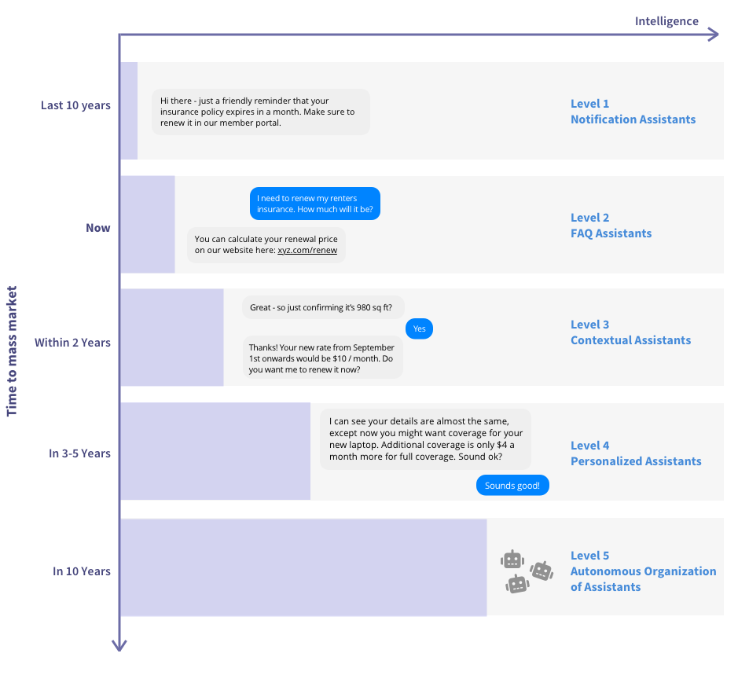

# Principais decisões do projeto

## **Desenvolver uma skill da Alexa**
  
Como principal fator de inovação para o tema do projeto será desenvolvido uma skill para Alexa da Amazon. Esta é uma assistente virtual personalizada e controlada por voz, que tem ganhado rápida popularidade nos últimos anos. 

A literatura indica algumas projeções de inteligência artificial conversacional juntamente com um guia dos cinco níveis de assistentes de IA, e isso pode ser visto na figura abaixo. 

A Alexa possui como classificação o nível 4, já que neste existe um grau de aprendizado amadurecido que faz com que a IA entre em contato e fale de forma proativa com base em contexto. Para isso, ela lembrará das preferências do usuário e fornecerá uma interface personalizada definitiva.

(Fonte: https://blog.rasa.com/conversational-ai-your-guide-to-five-levels-of-ai-assistants-in-enterprise/)

Em um estudo realizado em 2018 foi revelado o uso da Alexa se concentrou em verificar as previsões do tempo, em tocar música e controlar outros dispositivos, independente da faixa etária do usuário. 

(Fonte: https://journals.sagepub.com/doi/10.1177/0961000618759414#articleCitationDownloadContainer). 

Já no relatório feito pela consultoria eMarketer os resultados indicaram que a Alexa da Amazon seguirá na liderança do mercado de assistentes pessoais até 2021 controlando mais da metade de toda a indústria. Dentre as justificativas para essa projeção estão as constantes atualizações que a assistente recebe, - o que aumenta sua efetividade em comparação com concorrentes como o Google Assistente; e também a abertura para que desenvolvedores externos criem suas próprias skills compatíveis com dispositivos de outras marcas.

(Fonte: https://veja.abril.com.br/tecnologia/alexa-da-amazon-deve-manter-lideranca-no-mercado-de-assistentes-pessoais/)

## **Utilizar arquitetura de microsserviços e microfrontend**

O estilo arquitetural de microsserviços é uma abordagem que visa implementar uma aplicação como uma suíte de pequenos serviços, onde cada um executa um processo próprio e se comunica, geralmente, com requests HTTP. Em 2016, o termo micro frontend foi falado pela primeira vez no Thoughtworks Technology Radar, com o intuito de estender o conceito de microsserviços para o desenvolvimento frontend, onde cada uma desses “serviços” precisam ser completamente isolados dos outros com tecnologias e objetivos próprios.

Tendo em vista as principais características desses dois estilos arquiteturais, o app Zéfiro será criado com base neles. Teremos um microsserviço para o backend, chamado de Zéfiro API e dois micro frontends sendo eles, o Zéfiro APP e o Zéfiro Alexa Skills. Cada um desses três serviços terão seu próprio repositório, de forma que estes possuam ambiente de desenvolvimento, tecnologias, integração contínua e deploy específicos. 

O software Zéfiro será dividido em três serviços independentes:

* Zéfiro APP
* Zéfiro Alexa Skills
* Zéfiro API

## **Desenvolver um aplicativo**

De acordo com o Mobile Globe Report, os usuários têm passado mais tempo conectados a internet a partir dos seus celulares, do que em outros tipos de dispositivos. Comprovadamente, o celular é usado por mais de 67% da população, o que representa cerca de dois terços do mundo, com mais de 5,2 bilhões de pessoas.

Segundo dados obtidos através desta pesquisa, a média do tempo dedicado ao celular chega a ser de 30 a 40 horas semanais. As conexões a partir de smartphones tiveram um aumento de 6,20% em 2019, comparado a 2018. Países que apresentam uma média alta no tempo das suas conexões, geralmente são aqueles que contam com uma experiência positiva no uso de aplicativos móveis. 

(Fonte:https://www.comscore.com/por/Insights/Apresentacoes-e-documentos/2015/The-Global-Mobile-Report)

Dessa forma, surge a ideia de desenvolver um aplicativo mobile utilizando a tecnologia Flutter para que os usuários, sobretudo, àqueles que foram acometidos por doenças respiratórias consigam ter acesso rápido e prático a informações confiáveis sobre a qualidade do ar. Dentre algumas funcionalidades, temos o envio de notificações quando o índice de qualidade do ar estiver crítico para a saúde, exibição de gráficos com histórico da qualidade do ar nos últimos 7 dias, envio de alertas quando houver presença de fumaça no ar, recomendações de saúde e atividades para os usuários do aplicativo, dentre outras.

## **Utilizar como público-alvo pessoas portadoras de doença respiratória**
Com cerca de 4,5 milhões de óbitos anuais as doenças respiratórias crônicas representam cerca de 7% da mortalidade global. Apenas no Brasil, no ano de 2011, estas foram a terceira causa de morte no conjunto de doenças crônicas não transmissíveis. Além de provocar limitações físicas, emocionais e intelectuais, as DRC foram classificadas como responsáveis por 4% de todos os anos de vida perdidos ajustados por incapacidade em todo o mundo, de acordo com a Organização Mundial da Saúde. 
(Fonte:http://www.saude.gov.br/images/pdf/2016/maio/06/2015-026-doencas-respiratorias-cronicas.pdf)
 
A poluição atmosférica pode ser altamente nociva à saúde, assim como a fauna e flora. O monóxido de carbono, por exemplo, diminui a capacidade do sangue de transportar oxigênio, causando hipóxia tecidual, o ozônio, por ser oxidante e citotóxico, causa irritação nos olhos e diminuição na capacidade pulmonar, já o dióxido de enxofre e de nitrogênio podem causar graves irritações nas vias aéreas. Além disso, a poluição pode causar piores quadros de asma, infecções das vias aéreas, incidência de câncer de pulmão e doenças cardiovasculares. Um terço das mortes por derrame, câncer de pulmão e o doenças cardíacas se deve à poluição atmosférica,  sendo que em janeiro de 2019 a OMS apontou a poluição do ar como primeiro ponto de prioridade de saúde para os próximos 5 anos.  
(Fonte:https://www.saudeesustentabilidade.org.br/acoes/lancamento-da-analise-do-monitoramento-da-qualidade-do-ar-no-brasil-2019/)

Considerando as conexões entre as mudanças climáticas, emissão de poluentes e impactos na saúde, é perceptível que há uma necessidade global urgente em desenvolver e adotar ferramentas de comunicação de saúde pública, tanto em nível individual quanto governamental, para ajudar pessoas vulneráveis a reduzir sua exposição à efeitos da baixa qualidade do ar e possibilitar o acesso à informação. O uso da tecnologia é uma solução possível, com os aplicativos para dispositivos mobile e assistentes virtuais personalizados desempenhando um papel importante na conscientização e apoio aos mais diversos grupos sociais. 

## **Estruturar o escopo de funcionalidades com base nos ODS da Agenda 2030**

A Agenda 2030 para o Desenvolvimento Sustentável corresponde a um conjunto de programas, ações e diretrizes que orientam os trabalhos das Nações Unidas e de seus países membros rumo ao desenvolvimento sustentável. Ela é composta por 17 Objetivos do Desenvolvimento Sustentável (ODS) e 169 metas correspondentes, fruto do consenso obtido pelos delegados dos Estados Membros da ONU. 

(Fonte: http://www.comciencia.br/o-que-e-agenda-2030-das-nacoes-unidas-e-quais-sao-os-objetivos-de-desenvolvimento-sustentavel/)

Dentre os Objetivos de Desenvolvimento Sustentável elencados pela ONU, os três principais que se relacionam diretamente com o escopo de funcionalidades do nosso aplicativo e também da skill Alexa são:

**Objetivo 3**: Assegurar uma vida saudável e promover o bem-estar para todas e todos, em todas as idades

**Meta 3.9**: Até 2030, reduzir substancialmente o número de mortes e doenças por produtos químicos perigosos, contaminação e poluição do ar e água do solo

**Objetivo 12**: Assegurar padrões de produção e de consumo sustentáveis

**Meta 12.8**: Até 2030, garantir que as pessoas, em todos os lugares, tenham informação relevante e conscientização para o desenvolvimento sustentável e estilos de vida em harmonia com a natureza

**Objetivo 13**: Tomar medidas urgentes para combater a mudança climática e seus impactos

**Meta 13.b**: Promover mecanismos para a criação de capacidades para o planejamento relacionado à mudança do clima e à gestão eficaz, nos países menos desenvolvidos, inclusive com foco em mulheres, jovens, comunidades locais e marginalizadas

## **Escolha das tecnologias**

Para o desenvolvimento do Zéfiro, as tecnologias Flutter, NodeJS, MongoDB, Google Maps API, Alexa Kit foram escolhidas com base em três critérios principais: necessidades arquiteturais do sistema, conhecimento prévio e curva de aprendizado. O primeiro critério é importante, pois a escolha tecnológica deve sempre ter como objetivo a implementação da arquitetura do software. Os demais critérios levam em conta as experiências posteriores que os desenvolvedores possuem.

## **Escolha das diagramações**

Para descrever a arquitetura do software e seu comportamento interno foi decidido criar quatro diagramas distintos. O primeiro deles é o Diagrama de Relações que mostra as fronteiras do software e como as diferentes partes do mesmo se comunicam entre si. O diagrama de classes foi criado para mostrar como a estrutura do backend deve ser implementada. O diagrama de pacotes define a estrutura dos módulos e a dependência entre eles. Foi decidido criar dois diagramas de pacotes distintos: o do Zéfiro-APP e o do Zéfiro-API. Por último, foi criado um diagrama de sequência para descrever os diferentes processos que deverão ocorrer entre as diferentes partes do software.

## **Priorização das histórias de usuário**

Para escolher a ordem de implementação das features foi levado em conta o que é o cerne do software e como ele agrega valor ao usuário. Como todo o Zéfiro se alimenta da qualidade do ar e dos poluentes, essas partes precisam ser feitas primeiro. Com elas entregues e em funcionamento, será possível a implementação das notificações e do gráfico de histórico.

