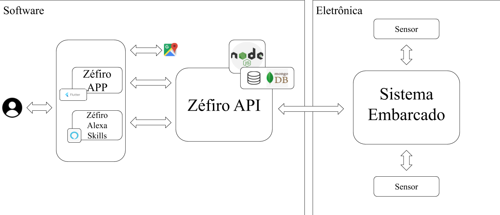

# Proposta de Solução

Para as propostas de solução fora levantados os requisitos dos subsistemas do projeto. Após isso as diretorias se reuniram e elaboraram uma proposta de solução.

## 1. Requisitos 

* **Histórico de IQA/Gráfico**:
  
– O sistema deve ser capaz de calcular o IQA;

– O sistema deve ser capaz de categorizar a qualidade do ar baseado nas medições dos sensores;

– O sistema deve ser capaz de receber os dados da estação de monitoramento;

– O sistema deve ser capaz de apresentar um gráfico intuitivo para o usuário;

– O sistema deve ser capaz de mostrar o histórico dos últimos 7 dias do IQA;

– O usuário deve ser capaz de filtrar o gráfico por período.

* **Informações sobre a IQA**:
  
– O sistema deve listar todos os poluentes do ar de acordo com os dados da estação;

– O sistema deve armazenar as informações personalizadas do usuário;

– O sistema deve cruzar as informações personalizadas do usuário com os poluentes do ar;

– O sistema deve apresentar as informações personalizadas para o usuário;

– O sistema deve apresentar uma proporção de quantidade de cada elemento presente no ar.

* **Iteração com a Alexa**:

– A Alexa deve responder questões sobre a qualidade do ar atualmente;

– A Alexa deve responder questões sobre quais são os poluentes presentes no ar;

– A Alexa deve responder questões personalizadas de acordo com o problema de saúde;

– A Alexa deve responder perguntas sobre o histórico da IQA.

* **Envio de notificações**:

– O sistema deve enviar uma notificação quando o IQA médio tiver um nível estabelecido;

– O sistema deve alertar dentro do aplicativo quando houver fumaça;

– O sistema deve notificar o usuário de acordo com as informações personalizadas;

* **Acompanhamento de status e local das estações**:
  
– O sistema deve receber a localização da estação;

– O sistema deve receber a localização do usuário;

– O sistema deve ser capaz de exibir as estações no mapa;

– O sistema deve ser capaz de apresentar o status do IQA para cada estação;

– O sistema deve apresentar o mapa para o usuário.

## 2. Solução de Software

### 2.1 Escopo da aplicação

Considerando as conexões entre as mudanças climáticas, emissão de poluentes e impactos na saúde, é perceptível que há uma necessidade global urgente em desenvolver e adotar ferramentas de comunicação de saúde pública, tanto em nível individual quanto governamental, para ajudar pessoas vulneráveis a reduzir sua exposição à efeitos da baixa qualidade do ar e possibilitar o acesso à informação. O uso da tecnologia é uma solução possível, com os aplicativos para dispositivos mobile e assistentes virtuais personalizados desempenhando um papel importante na conscientização e apoio aos mais diversos grupos sociais.

Diante disso surge a necessidade da criação do aplicativo Zéfiro, que estará disponível para Android e iOS, voltado para a população com problemas respiratórios. Eleserá responsável por informar e sugerir de meios de prevenção contra crises de problemas de saúde, além de notificar os usuários quando a qualidade do ar estiver baixa.

Dentre algumas funcionalidades, temos o envio de notificações quando o índice de qualidade do ar estiver crítico para a saúde, exibição de gráficos com histórico da qualidade do ar nos últimos sete dias, envio de alertas quando houver presença de fumaça no ar, recomendações de saúde e atividades para os usuários do aplicativo, exibição de atuais componentes do ar que o usuário está respirando, disponibilização de localidade das estações de monitoramento em funcionamento e o índice de qualidade do ar coletado por ela.
 
O Zéfiro também contará com uma skill da Alexa, onde o usuário poderá receber informações sobre a qualidade do ar através de perguntas. O Zéfiro precisará ser capaz de responder perguntas utilizando os dados coletados nas estações de monitoramento do ar.

### 2.2 Definição de Arquitetura

O estilo arquitetural de microsserviços é uma abordagem que visa implementar uma aplicação como uma suíte de pequenos serviços, onde cada um executa um processo próprio e se comunica, geralmente, com requests HTTP (JACKSON, 2019). Em 2016, o termo micro frontend foi falado pela primeira vez no Thoughtworks Technology Radar, com o intuito de estender o conceito de microsserviços para o desenvolvimento frontend, onde cada uma desses “serviços” precisam ser completamente isolados dos outros com tecnologias e objetivos próprios (GEERS, 2017).

Tendo em vista as principais características desses dois estilos arquiteturais, o software Zéfiro será criado com base neles. Com isso haverá um microsserviço para o backend, chamado de Zéfiro API e dois micro frontends sendo eles, o Zéfiro APP e o Zéfiro Alexa Skills. Cada um desses três serviços terão seu próprio repositório, de forma que estes possuam ambiente de desenvolvimento, tecnologias, integração contínua e deploy específicos (LEWIS; FOWLER, 2016).

O software Zéfiro será dividido em três serviços independentes:

* Zéfiro APP
* Zéfiro Alexa Skills
* Zéfiro API

Para o desenvolvimento do software, faz-se necessário o consumo de dados de fontes externas, sendo elas:

* Google Maps API

### 2.3 Representação dos Serviços

#### 2.3.1 Zéfiro APP

O Zéfiro APP será uma aplicação mobile responsável pelo contato direto com o usuário. Esta precisará seguir uma arquitetura da informação bem definida e garantir acessibilidade. Ela é responsável também por exibir um gráfico com o histórico do indicador de qualidade do ar, apresentar informações sobre quais poluentes o usuário está respirando naquele momento e um mapa com as estações de monitoramento do ar. Precisa ainda enviar notificação para o usuário e exibir um alerta de fumaças.

#### 2.3.2 Zéfiro Alexa Skills

O Zéfiro Alexa Skills será uma aplicação que faz interação com o usuário por meio de comandos de voz. Ela será responsável por responder como está a condição do ar, com base na faixa de qualidade do ar internacional, como estava a qualidade do ar nos últimos sete dias e quais são os poluentes que o usuário está respirando no momento do seu pedido.

#### 2.3.3 Zéfiro API

O Zéfiro API é responsável por lidar com o core do projeto - monitoramento da qualidade do ar. Para isso ele possui diversas funcionalidades, a principal delas é o cálculo da qualidade do ar, feita de acordo com a faixa de qualidade do ar internacional e utilizando as informações coletadas dos poluentes, para que com isso possa existir a criação de gráficos que serão apresentados ao usuário.

Além do cálculo, as informações de quais elementos químicos estão presentes, suas quantidades e o indicativo de fumaça serão disponibilizados para o usuário. Além disso, o Zéfiro APP precisará fazer o envio de notificações ao usuário sempre que a qualidade do ar estiver baixa.

A última funcionalidade presente neste serviço é a exibição de uma mapa contendo todas as estações de monitoramento do ar e seus respectivos status. Para isso ser feito será necessário o consumo da Google Maps API, de forma que auxilie a criação desse mapa de forma mais segura.

### 2.5 Pacotes de Design Significativos do Ponto de Vista da Arquitetura

#### 2.5.1 Diagrama de Pacotes

#### 2.5.2 Diagrama de Classes

